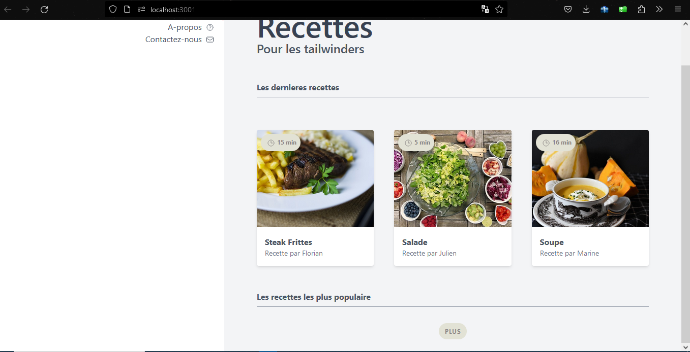
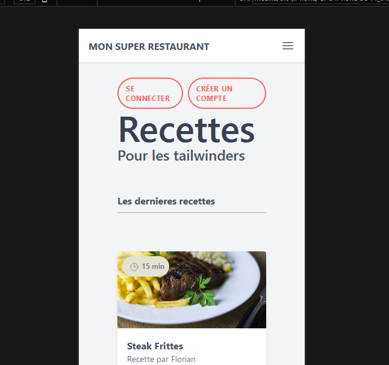
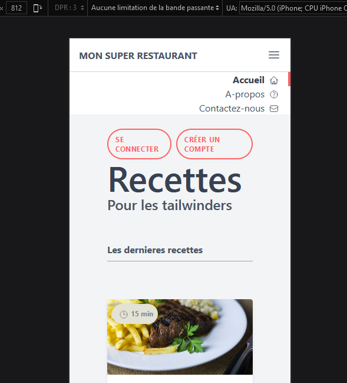
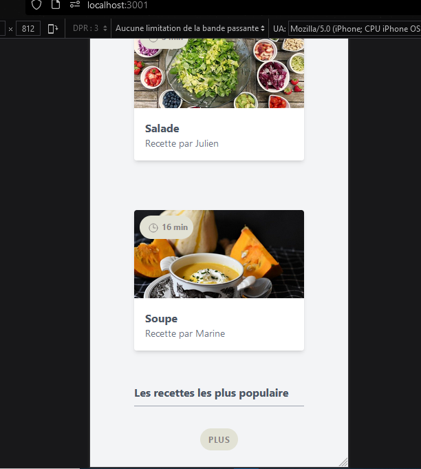

[TailwindCSS 2 par la pratique - 2021 | Udemy](https://www.udemy.com/course/tailwindcss-2-par-la-pratique/learn/lecture/25434024#overview)

https://heroicons.com/

# Directive

1. Squelette de notre page web

* Créer le wrapper de contenu tailwindcss
* Créer le nav: titre, menue accuel, à propos, contactez-nous
* Créer le main: se connecter et créer un compte, header (recettes, pour les tailwinders). Mes dernieres recettes qui contient les cartes (img, titre, auteur) de nos recettes. Les recettes les plus populaires qui contient les cartes les plus populaire
* Un bouton plus

    2. Ajoutez l'image

* Couleur de base texte: text-gray-600

Finale:

